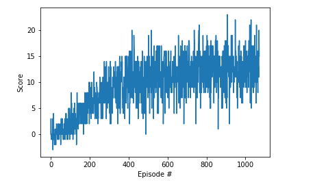
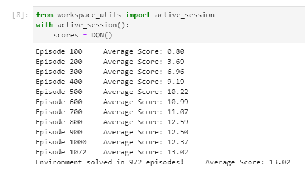

## Report
---
The aim of the project was to train a Deep Reinforcement Agent to solve the *_Udacity's Banana Collecter Unity Env_* [(Windows x64 verion)](https://s3-us-west-1.amazonaws.com/udacity-drlnd/P1/Banana/Banana_Windows_x86_64.zip). 

For details on the nature of the environment see README.md

## Algorithm

The agent was trained used a `Deep Q-Network` along with a `Replay Buffer` implementation. This was sufficient to solve the environment in 972 episodes. 

### Hyper Parameters  

```
n_episodes = 3500       # max number of iterations`
eps_start = 1           # initial epsilon value
eps_end = 0.1           # minimum epsilon value
eps_decay = 0.995       # epsilon decay rate 

BUFFER_SIZE = int(1e6)  # replay buffer size
BATCH_SIZE = 256        # minibatch size
GAMMA = 0.99            # discount factor
TAU = 5e-3              # for soft update of target parameters
LR = 1e-3               # learning rate
UPDATE_EVERY = 4        # how often to update the network
```

### Neural Network
The [QNetwork model](https://github.com/diarmaidfinnerty/DRF_Navigation/blob/main/model.py) consisted of a simple feedforward neural network containing a single hidden layer. 

The neural network had:
    - 37 input nodes, relating to each of the state space dimensions.
    - 64 hidden layer nodes.
    - 4 output nodes, relating to each of 4 actions the agent can take. 
    - ReLU activation functions. 

## Training Rewards

#### Rewards plot

#### Reward progression during training. 



## Future Work
The agent could be improved by utilising a different learning algorithm. 

Examples of possible algorithms are:

    - Dueling DQN Network
    - Double DQN Network
    
As well as using an improved memory method such as:

    - Prioritized Memory

